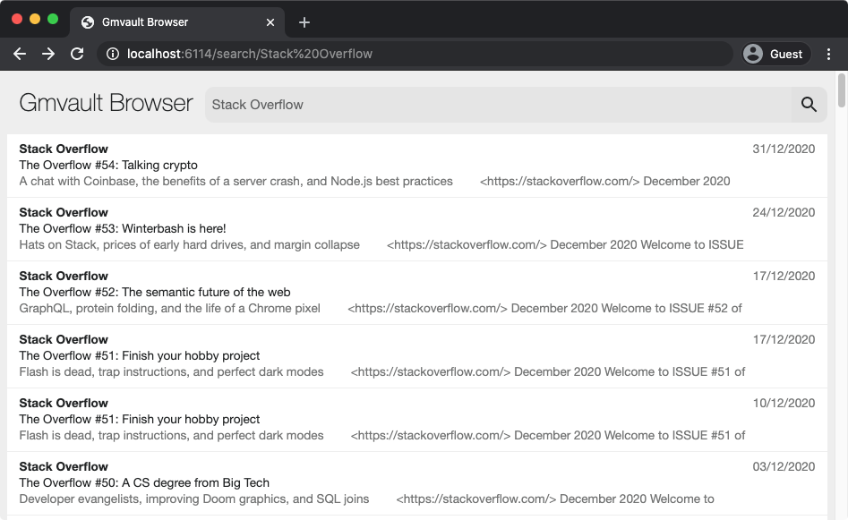
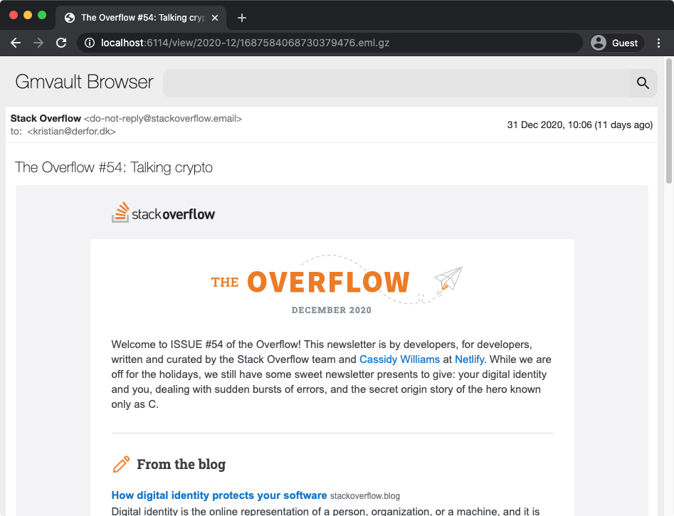

# Gmvault Webreader

A web interface for browsing, reading and ever-so-slowly searching through [Gmvault backups](https://github.com/guillaumeaubert/gmvault-docker) that look something like this:

    |-- 2006-01
    |   |-- 123456788.eml.gz
    |   +-- 123456789.eml.gz
    |   +-- ...
    |-- 2006-02
    |   |-- 223456788.eml.gz
    |   |-- 223456789.eml.gz
    |   |-- ...
    |-- ...
    |   |-- ...

Nothing will be extracted (except in memory) for searching and navigation, rendering the whole thing pretty damn slow. On the bright side, it doesn't eat up a bunch of unnecessary space or resources because of this.

### List and search view

#### Email view

## Usage

- Download (and extract) or clone this repository.
- Build using Docker: `docker build . -t kbadk/gmvault-webreader`
- Run using Docker: `docker run -p 6114:6114 -v /path/to/gmail/db:/db:ro kbadk/gmvault-webreader`
- Point your browser at http://localhost:6114/.

Or if you insist on running it bare metal:

- Install Node 12 or later.
- Download (and extract) or clone this repository.
- Install dependencies: `npm install --production`.
- Set `mailRoot` to point to your Gmvault backup directory in `config.js`.
- Start the thing: `npm start`.
- Point your browser at http://localhost:6114/.

### Configuration

Can be configured through environment variables (or alternatively `config.js`).

| Variable name | Default value | Description             |
| ------------- | ------------- | ----------------------- |
| `WEB_ROOT`    | /             | Web root directory      |
| `PORT`        | 6114          | Listening port          |
| `MAIL_ROOT`   | /db           | Path to Gmvault backups |

The only one you should really configure is `WEB_ROOT`. `PORT` and `MAIL_ROOT` should instead
be mapped when running it with Docker.

If you want this thing to run behind a reverse proxy (and you should), you can setup Nginx something like this:

    server {
    	listen 80;

    	location /mail {
    		proxy_pass http://localhost:6114;
    		proxy_http_version 1.1;
    		proxy_set_header Upgrade $http_upgrade;
    		proxy_set_header Connection "Upgrade";
    	}
    }

When serving this application from a sub folder (e.g. `/mail` in the above), remember to
configure `WEB_ROOT` accordingly (e.g. `WEB_ROOT=/mail/`).
