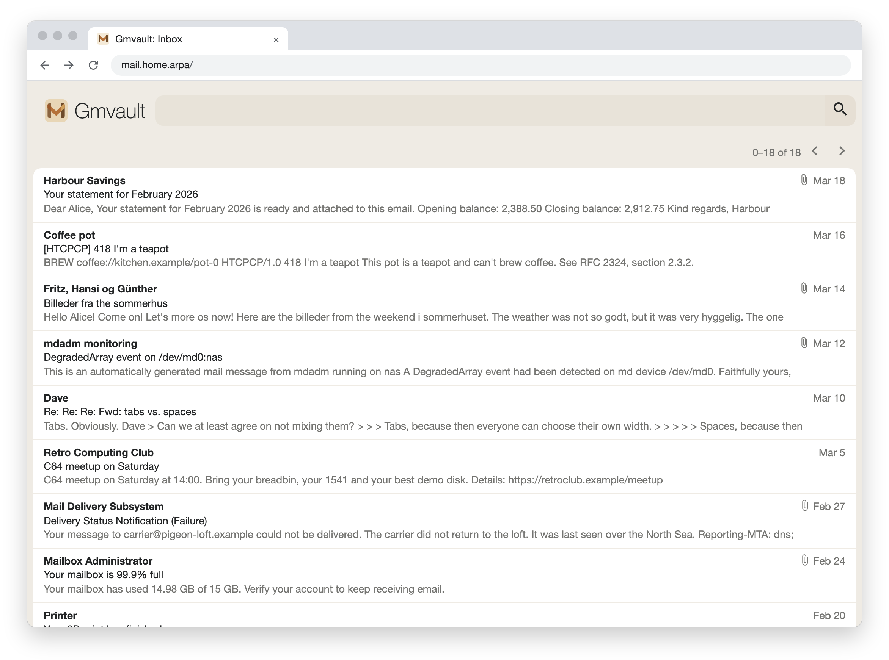
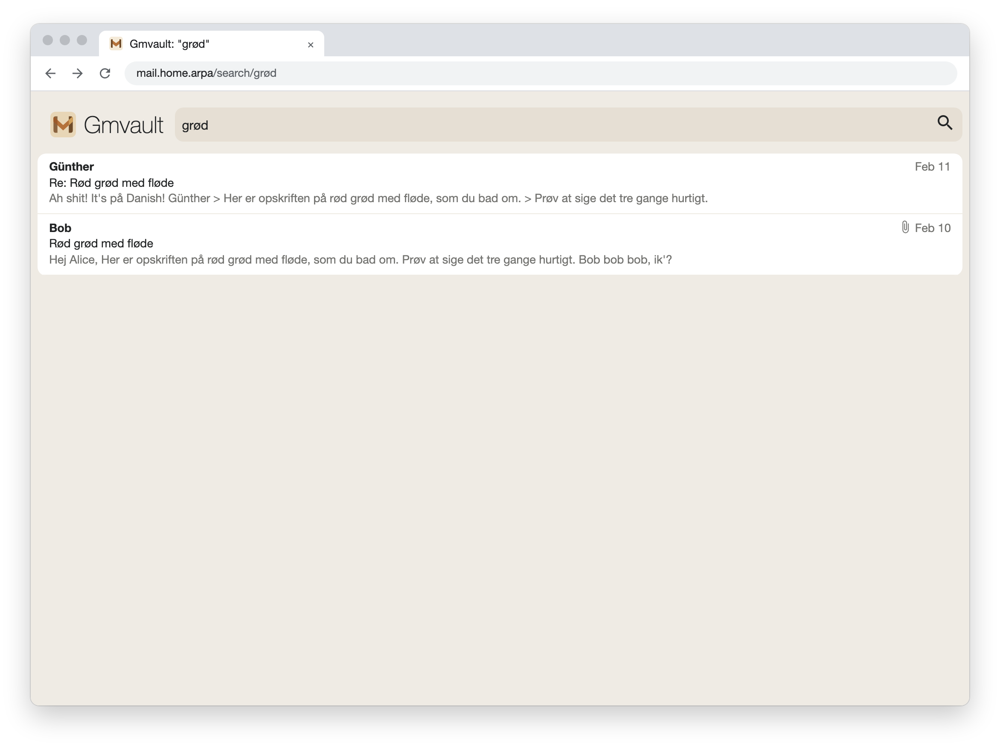
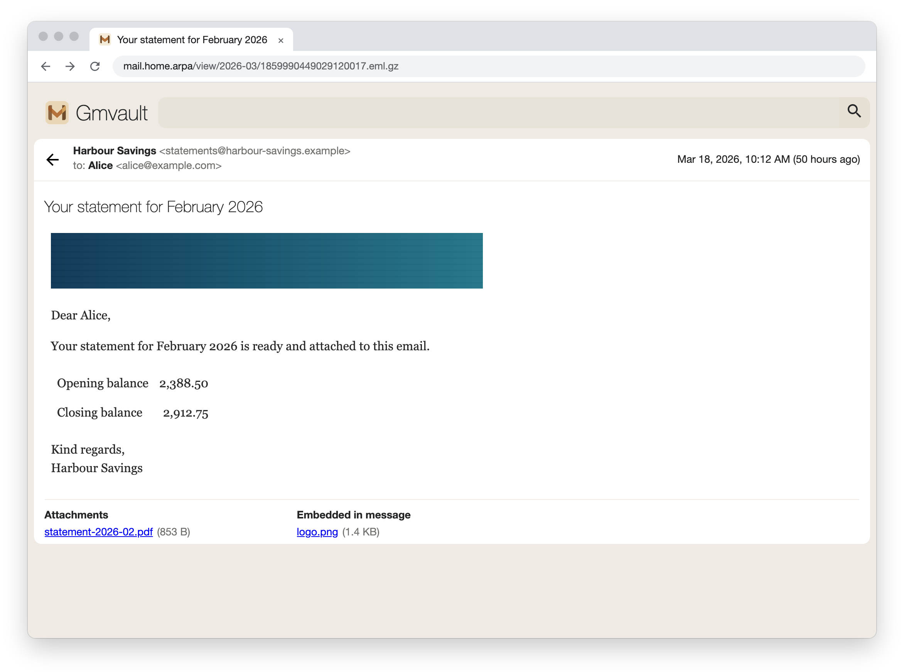

# Gmvault Webreader

A web interface for browsing, reading and ever-so-slowly searching through [Gmvault backups](https://github.com/guillaumeaubert/gmvault-docker) that look something like this:

    |-- 2006-01
    |   |-- 123456788.eml.gz
    |   +-- 123456789.eml.gz
    |   +-- ...
    |-- 2006-02
    |   |-- 223456788.eml.gz
    |   |-- 223456789.eml.gz
    |   |-- ...
    |-- ...
    |   |-- ...

Nothing will be extracted (except in memory) for searching and navigation, rendering the whole thing pretty damn slow. On the bright side, it doesn't eat up a bunch of unnecessary space or resources because of this.

Attachments are listed below each email, and can be opened (PDFs, images and text) or downloaded. Emails are shown in a
sandboxed frame, so any scripts in them can't run.

### Inbox

### Search

### Email view

The screenshots show the fictional test mailbox described under [Development](#development).

## Usage

- Download (and extract) or clone this repository.
- Build using Docker: `docker build . -t kbadk/gmvault-webreader`
- Run using Docker: `docker run -p 6114:6114 -v /path/to/gmail/db:/db:ro kbadk/gmvault-webreader`
- Point your browser at http://localhost:6114/.

Or if you insist on running it bare metal:

- Install Node 22 or later.
- Download (and extract) or clone this repository.
- Install dependencies: `npm ci`.
- Build JavaScript bundle: `npm run build`
- Point `MAIL_ROOT` at your Gmvault backup directory, e.g. `export MAIL_ROOT=/path/to/gmail/db` (or set `mailRoot` in
  `config.js`).
- Start the thing: `npm start`.
- Point your browser at http://localhost:6114/.

### Configuration

Can be configured through environment variables (or alternatively `config.js`).

| Variable name | Default value | Description             |
| ------------- | ------------- | ----------------------- |
| `WEB_ROOT`    | /             | Web root directory      |
| `PORT`        | 6114          | Listening port          |
| `MAIL_ROOT`   | /db           | Path to Gmvault backups |

The only one you should really configure is `WEB_ROOT`. `PORT` and `MAIL_ROOT` should instead
be mapped when running it with Docker.

If you want this thing to run behind a reverse proxy (and you should), you can setup Nginx something like this:

    server {
    	listen 80;

    	location /mail {
    		proxy_pass http://localhost:6114;
    		proxy_http_version 1.1;
    		proxy_set_header Upgrade $http_upgrade;
    		proxy_set_header Connection "Upgrade";
    		proxy_set_header X-Forwarded-Host $http_host;
    	}
    }

The `X-Forwarded-Host` header is required: the websocket only accepts connections whose `Origin` matches the host
the app is served from, so that other websites can't read your email through it.

When serving this application from a sub folder (e.g. `/mail` in the above), remember to
configure `WEB_ROOT` accordingly (e.g. `WEB_ROOT=/mail/`).

## Development

`test/mailbox/` is a small Gmvault backup of made-up emails, covering attachments, embedded images, plain-text emails,
a bounce, and an email full of scripts that shouldn't run. Use it to try the app without your own mail:

    npm ci
    npm run build
    MAIL_ROOT=test/mailbox npm run dev

Run `npm run watch` alongside to rebuild the client when it changes.

The mailbox is generated by `scripts/generate-test-mail.js`. After changing that script, regenerate it with
`npm run generate-test-mail`.

### Tests

- `npm test` runs the server tests against the test mailbox.
- `npm run test:browser` runs the browser tests (rendering, sandboxing, page titles) in Chromium. Build the client
  first, and install Chromium once with `npx playwright install chromium`.
- `npm run screenshots` renders the screenshots in this README from the test mailbox, also with Chromium.
